<h1><code>Leonardo Vanni</code></h1>

<em>Construindo sistemas que geram impacto no mundo real.</em>

<a href="https://portfolio-v2-omega-swart.vercel.app/">Portfólio</a>
&nbsp;·&nbsp;
<a href="https://www.linkedin.com/in/leonardo-vanni-bonavigo-6a387020b/">LinkedIn</a>
&nbsp;·&nbsp;
<a href="https://instagram.com/leonardobonavigo">Instagram</a>

  

<h3><code>leo@github ~ $ trace request --flow</code></h3>

  

<h3><code>leo@github ~ $ ./contributions.sh</code></h3>

  

<h3><code>leo@github ~ $ whoami</code></h3>
<table>
  <tr>
    <td valign="top"></td>
    <td valign="top"></td>
  </tr>
</table>

  

<h3><code>leo@github ~ $ ./stats.sh</code></h3>
<table>
  <tr>
    <td valign="top">
      
    </td>
    <td valign="top">
      
    </td>
  </tr>
</table>

